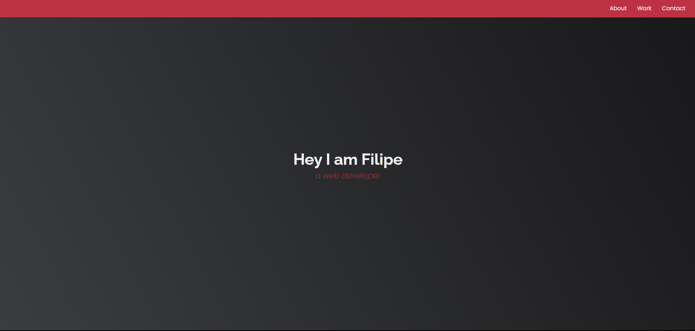

# 🚀 Landing Page
​
Welcome to the **Landing Page** repository! This project consists of a responsive landing page, developed with **HTML5** and **CSS3**. The goal is to practice creating promotional pages that highlight products or services in a clear and attractive way.

## Layout

    

## 📋 Features

- **Responsive Design:** Adapts to different screen sizes, ensuring a good experience on mobile devices and desktops.

- **Informational Sections:** Includes sections such as "About", "Services" and "Contact" to provide detailed information.

- **Smooth Navigation:** Navigation links that lead to specific sections of the page to facilitate usability.​

## 🛠️ Technologies Used

- **HTML5:** Semantic structuring of the page content.

- **CSS3:** Responsive page styling and layout.